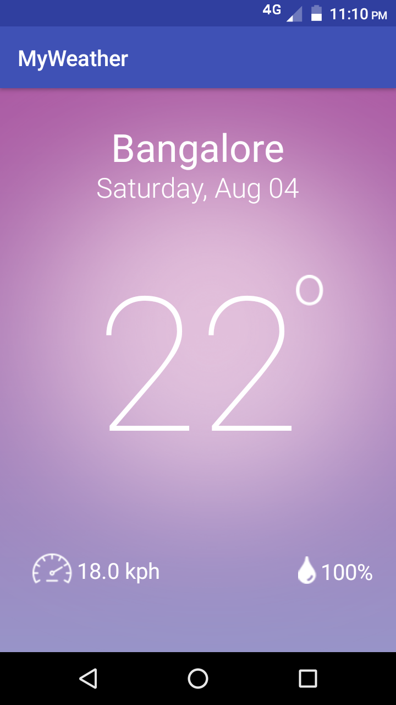

# MyWeather

Steps to Build this app.
Get your API key by signing in.              https://home.openweathermap.org/api_keys
data can be fetched using JSON,XML or HTML in this app i used JSON. 
You can get current weather data by using cityname,cityid,zipcode,coordinates and i used coordinates from gps. for more info https://openweathermap.org/api
This app uses permission  android.permission.INTERNET,android.permission.ACCESS_COARSE_LOCATION,android.permission.ACCESS_FINE_LOCATION" />
    and i used volley library for http request.
    Dependencies used ---->  compile 'com.android.volley:volley:1.0.0'
   feel free to make any changes.
    
